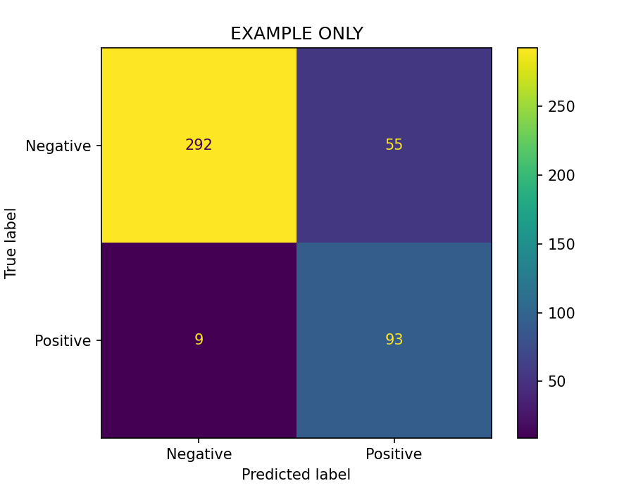

# {Model Name} Model Card

## Specification

_This section contains top-level information about what the model is. The details of this section are in a table format so as to quickly give the reader the relevant information._

|  |  |
| ---- | ---- |
| **Description:** | General overview of the model, what it does, and motivation for developing it. No more than one paragraph|
| **Model Type:** | Specify the type of model (e.g., clustering, time series, deep learning models, reinforcement learning, supervised learning, ensemble, hybrid, etc.) and describe its main characteristics|
| **Developed By:** | Name of the developer or development team |
| **Launch Date:** | Expected or Launch Date |
| **Version** | As in model registry |

## Intended Use

_This section goes into more detail about why the model was built and who it was for. This section can go into more depth than previous, but should still be as succinct as possible._

**Development Background:** A brief description of the model's development purpose and context, this is a chance to expand on the description, any additional background information on the model's focus area, who this originally created for and how the model fits into the wider decision making process.

**Scope:** Specific application or functionality of the model.

**Intended Users:** Describe who the model is intended for.

**Use cases out of scope:** Describe any potential use cases out of scope.

## Data

_This section should provide basic details about the data used in and by the model. Any more detail should be provided in supplementary information, such as a DataSheet._

**Data Overview:** A brief overview of where the data comes from, the type of data and it's coverage etc.

**Sensitive Data:** How is any sensitive data handled?

**Pre-processing and cleaning:** How was the data cleansed?, was it's suitability verified before use?, why these datasets?, are they representative?

**Data Split:** 
| Type | Split | Description |
| ---- | ---- | ---- |
| **Training:** | x% | Use this space to describe the training data, expanding on the data overview |
| **Testing:** | x% | Use this space to describe the testing data, expanding on the data overview |
| **Validation:** | x% | Use this space to describe the validation data, expanding on the data overview |

## Methodology and Training

_This section should explain how the model was built to do what it does, including any justification where required. Lengthy debate or detail of particular methodology should be provided in user documentation and not in the model card._

**Model Type:** Specify the type of model (e.g., clustering, time series, deep learning models, reinforcement learning, supervised learning, ensemble, hybrid, etc.) and describe its main characteristics.

**Models Used:** What models were used (e.g. embedding x + classifier y)

**Justification:** Explain here why this approach was taken over another.

**Algorithm Details:** Describe the main steps when data is sent to the model for inference, e.g. how is text data converted into a binary class?

**Feature Engineering:** Details on the process of creating and selecting features if relevant.

**Alternative Methods Considered:**
1. Option B
2. Option C etc.

### Training Methods:

**Training Process:** Description of the model training process.

**Hyperparameter/Fine Tuning:** _(optional)_ Detail any additional  processes to select appropriate hyperparameters or other types of fine tuning.

## Evaluation and Performance

_This section details how well the model peforms._

_Note: The metrics and visual in this section is an example only and is not intended to indicate what evaluation methods and visuals you should use. Please adjust the types of metrics and visuals appropriately to suit requirements._

### Model Evaluation

**Evaluation Process:** How the model is evaluated.

**Evaluation Focus:** _(optional)_ If relevant, provide detail and an explanation for why a particular metric (e.g. F1 score), or performance for/across specific data subset/s was prioritised.

**Performance breakdown:** Details on the model's performance across different subsets or categories of data.

**Metrics:** Use the table below for performance metrics, adjust as appropriate.

| Metric | Value |
| ---- | ---- |
| F1 Score | 0.00 |
| Precision | 0.00 |
| Recall | 0.00 |

 

**Performance in Deployment**: Detail the perfomance of the model in deployment once monitoring is completed. State any considerations taken for the model inference time and provide the results in brief.

### Ethical Considerations

**Bias and fairness analysis:** Describe the approach for analysing error and the insights gained from them.

**Implications for human safety:** Potential impact on human life, potential harm and safety and mitigatation.

### Caveats

**Caveats and Limitations:** Describe here any important information or limitations (e.g.how will an NLP model handle changes in human language like new slang).
